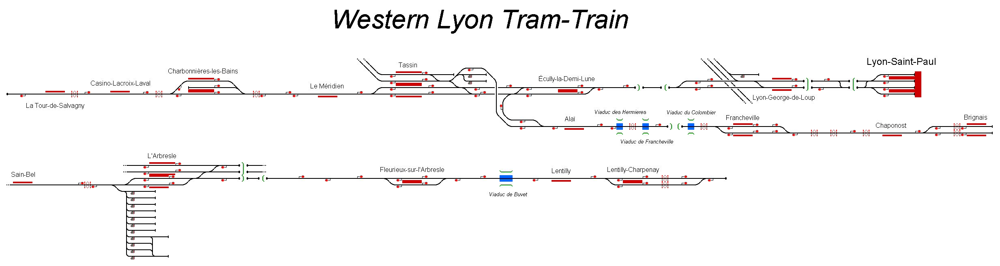

# Western Lyon Tram Train

Representation of the railway network operating from Lyon-Saint-Paul station in the City of Lyon, France. The two routes to Brignais and Sain-Bel are operated by Alstom light rail rolling stock.

## Current Status

| Stage         | Status        |
| ------------- |:-------------:|
| Track Plan     | :heavy_check_mark: |
| Signalling      | :heavy_check_mark:      |
| Naming | :heavy_check_mark:      |
| Speed Limits | :heavy_check_mark: |
| Distances | :heavy_check_mark: |
| Timetable | :heavy_check_mark: |
| Documentation | :heavy_check_mark: |

## Data Sources

- [Cab Ride Automnal 4K // de Sain-Bel à Lyon-St-Paul [Tram-Train Ouest Lyonnais] - MetroGone (Youtube)](https://www.youtube.com/watch?v=t0b_fLT1xUU)
- [Cab Ride 4K de Brignais à Lyon-St-Paul - MetroGone (Youtube)](https://www.youtube.com/watch?v=eimhNG0yz7c)